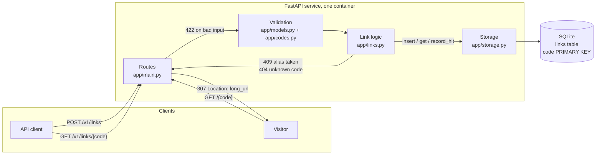
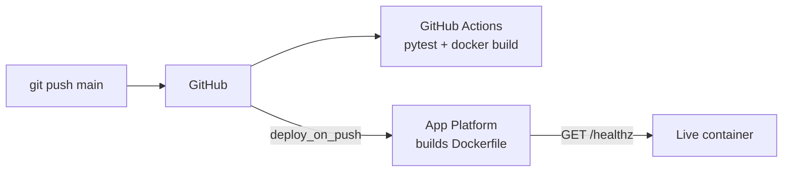

# URL Shortener

A REST service that accepts a long URL, returns a short code, redirects visitors
of the short code to the long URL, and reports metadata about each link.

Python 3.12, FastAPI, SQLite. Deployed to DigitalOcean App Platform from the Dockerfile.

Live: https://url-shortener-pta8k.ondigitalocean.app/healthz

## API

| Method | Path              | Purpose                                  | Success | Errors |
|--------|-------------------|------------------------------------------|---------|--------|
| GET    | /healthz          | Platform health check                    | 200     |        |
| POST   | /v1/links         | Create a link; optional custom alias     | 201     | 422 invalid, 409 alias taken |
| GET    | /v1/links/{code}  | Metadata for one link                    | 200     | 404 unknown code |
| GET    | /{code}           | Redirect to the long URL, count the hit  | 307     | 404 unknown code |

Interactive docs are served at `/docs`.

Every error is JSON with one message that names the offending field:

    {"error": "long_url: must start with http:// or https://"}

### Create a link

    curl -X POST https://url-shortener-pta8k.ondigitalocean.app/v1/links \
      -H 'content-type: application/json' \
      -d '{"long_url": "https://www.digitalocean.com/products/app-platform"}'

    {
      "code": "mHlophd",
      "long_url": "https://www.digitalocean.com/products/app-platform",
      "short_url": "https://url-shortener-pta8k.ondigitalocean.app/mHlophd",
      "custom": false,
      "hit_count": 0,
      "created_at": "2026-09-22T19:19:59Z"
    }

Add `"alias": "launch"` to the body to choose the code yourself.

### Follow a link

    curl -i https://url-shortener-pta8k.ondigitalocean.app/mHlophd

    HTTP/1.1 307 Temporary Redirect
    location: https://www.digitalocean.com/products/app-platform

### Read metadata

    curl https://url-shortener-pta8k.ondigitalocean.app/v1/links/mHlophd

Same shape as the create response, with `hit_count` reflecting redirects served.

## Validation rules

- `long_url`: required, at most 2048 characters, scheme `http` or `https`, non-empty host.
  Not fetched to check it resolves: that is slow and would let callers make the
  server request arbitrary addresses.
- `long_url` pointing at this service's own host is rejected, to prevent redirect loops.
- `alias`: optional, 3 to 32 characters from `[A-Za-z0-9_-]`, case-sensitive, stored as given.
  Reserved words (`healthz`, `v1`, `docs`, `redoc`, `openapi.json`) are rejected.
- Alias already in use returns 409, a conflict rather than a validation failure.
- The same `long_url` submitted twice without an alias gets two different codes,
  so two callers never share a hit count.

## Architecture

### Request lifecycle

Create: the body is validated by Pydantic (shape, URL rules, alias rules). The link
layer refuses self-referencing URLs, then either inserts the custom alias or generates
random codes until one inserts cleanly. The primary key on `code` is what makes both
alias uniqueness and collision detection reliable.

Redirect: one `UPDATE ... RETURNING` both increments the hit count and fetches the
target, so a redirect is a single write. Unknown codes are 404 in the same JSON shape
as every other error.

### Delivery

CI and deploy run in parallel from the same push. App Platform only routes traffic to
a new container once `/healthz` answers.

## Design decisions

**307, not 301.** A 301 is cached by browsers, so repeat visits would never reach the
service and the hit count would be wrong. 307 costs one extra round trip per visit,
which is the price of having metadata.

**Random codes, not an encoded counter.** 7 characters of base62 gives about 3.5 trillion
codes. Random needs no shared counter across instances and does not reveal how many
links exist. Collisions are handled by retrying the insert, up to five times.

**SQLite behind a Storage class.** Persistence is real locally and across process
restarts, and nothing outside `app/storage.py` knows how data is stored. The trade-off:
App Platform's disk is ephemeral, so links do not survive a redeploy, and a second
container would not share them. This is visible during a rolling deploy: for a minute or
so, requests are split between the old and new containers, and a link created on one
returns 404 from the other. The production answer is managed Postgres, which is a
change inside that one file. Hit counting is a synchronous row update; at scale that
becomes the write bottleneck and would move to an event stream with async aggregation.

**Routes hold no logic.** `app/main.py` maps HTTP to calls in `app/links.py`. Validation
is in the schemas, storage is in storage. Each layer can be tested and swapped alone.

## Run locally

    python3 -m venv .venv && source .venv/bin/activate
    pip install -r requirements.txt
    uvicorn app.main:app --reload --port 8080

Then open http://localhost:8080/docs.

## Test

    pytest -q

27 tests, run with FastAPI's `TestClient` against the real routes. Each test gets a
fresh SQLite file, so tests never depend on each other. They cover every endpoint's
success path and every validation rule above.

Not covered: concurrent writes, behaviour under load, the deployed database, and the
Dockerfile beyond CI checking that it builds. Those would be the next tests to add,
in that order.

## Configuration

| Variable        | Default                  | Purpose                                  |
|-----------------|--------------------------|------------------------------------------|
| `DATABASE_PATH` | `./links.db`             | SQLite file location                     |
| `BASE_URL`      | `http://localhost:8080`  | Used to build `short_url` in responses   |

## Deploy

The app spec is in `.do/app.yaml`. It binds `BASE_URL` to App Platform's `${APP_URL}`
and sets the health check to `/healthz`.

    doctl apps create --spec .do/app.yaml

After that, every push to `main` redeploys.

## Layout

    app/main.py        routes only
    app/models.py      request and response schemas, URL validation
    app/codes.py       code generation, alias rules, reserved list
    app/links.py       create, get, follow; the only caller of storage
    app/storage.py     Storage class over SQLite
    app/config.py      settings from environment variables
    tests/             pytest, one file per feature
    .github/workflows/ci.yml
    .do/app.yaml
    Dockerfile, requirements.txt
    spec.md            the plan this was built from

## Next steps

In the order I would do them:

1. Structured request logging (method, path, status, latency, code) so the redirect
   path is observable.
2. `DELETE /v1/links/{code}`, so a bad link can be retired.
3. `expires_at` on create, checked on redirect.
4. Managed Postgres, then a second instance.
5. Rate limiting on create, since it is the only unauthenticated write.
