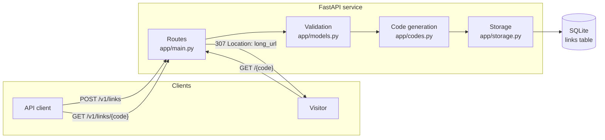
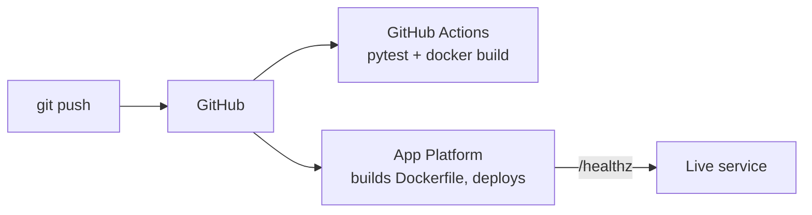

# URL Shortener

A REST service that accepts a long URL, returns a short code, redirects visitors
of the short code to the long URL, and reports metadata about each link.

Python 3.12, FastAPI, SQLite. Deployed to DigitalOcean App Platform from the Dockerfile.

## Architecture

## Run locally

    python3 -m venv .venv && source .venv/bin/activate
    pip install -r requirements.txt
    uvicorn app.main:app --reload --port 8080

## Test

    pytest -q

## Deploy

    doctl apps create --spec .do/app.yaml
